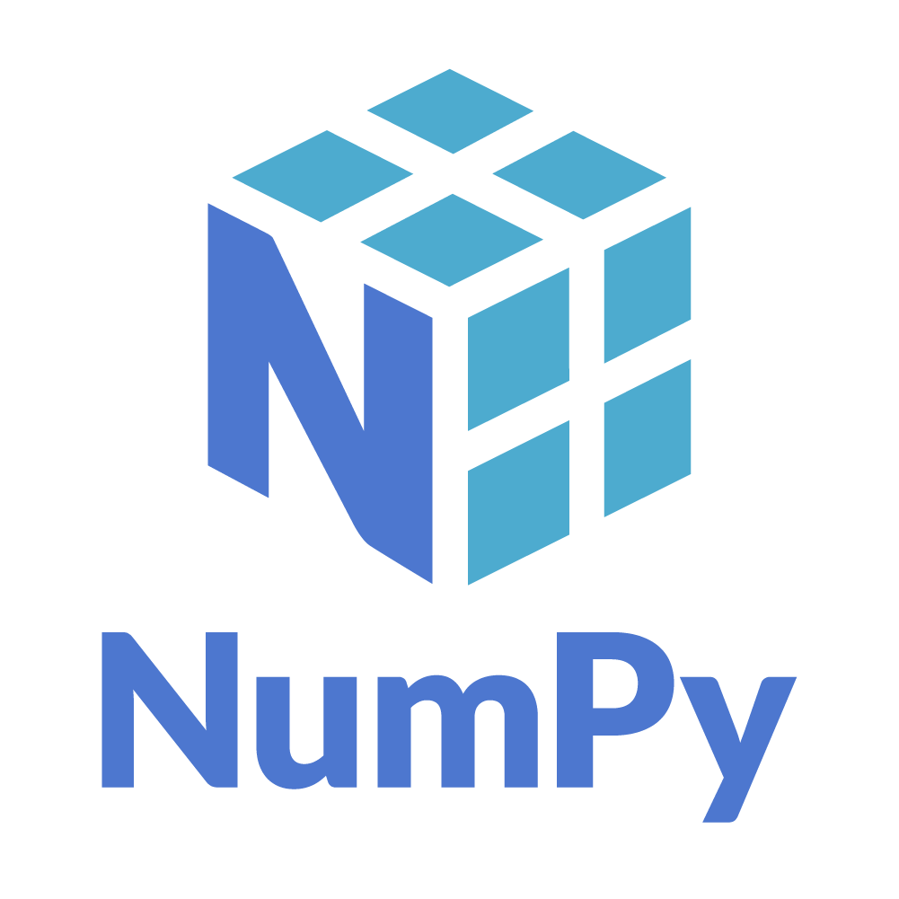
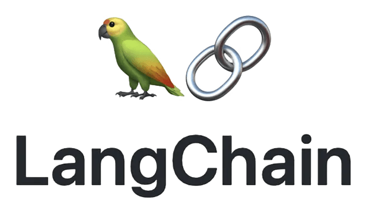
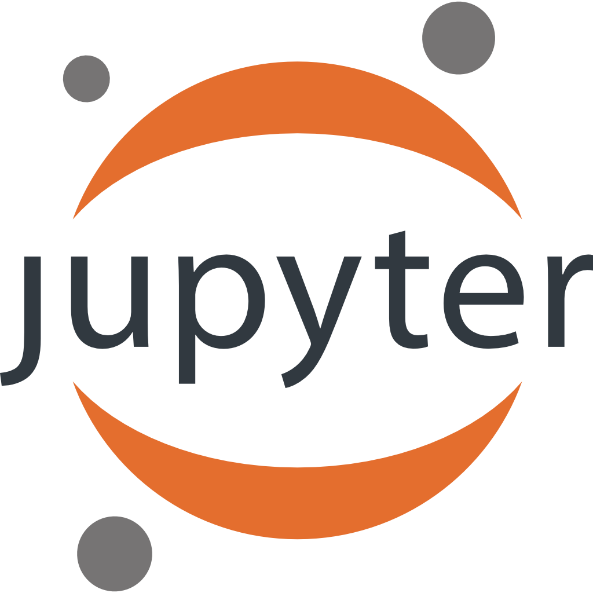

  
  

<!-- Add second GIF here -->

  

<!-- Profile Views -->

 
   

---

### 🔥 About Me
- 🔭 I’m currently working on **Lumos (Transformer)**
- 🌱 I’m learning **LangChain & LangGraph**
- 👯 I’m looking to collaborate on **Lumos (Dataset)**
- 🤝 I’m looking for help with **Lumos (Dataset)**
- 💬 Ask me about **TensorFlow, PyTorch**
- 📫 Reach me at **karanshelar8775@gmail.com**
- 📄 Know about my experiences → [My Resume](https://drive.google.com/file/d/13cGAIaOflBjiEKbgyQ_-56oJkbKoLytW/view?usp=drivesdk)  
- ⚡ Fun fact: **I can visualize complex things and make them simple.**

---

### 💻 I Love Coding

  

### 🌐 Connect with me

---

### ⚙️ Languages and Tools

  
  
  
  
  
  
  
  
  
  
  
  
  
  
  
  

---

### 📊 GitHub Stats

  

  

  

